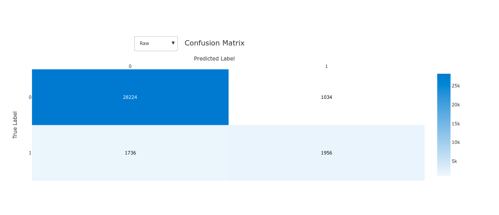
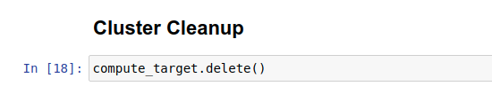
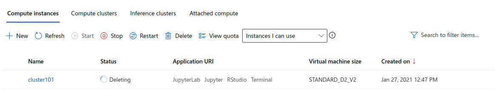

# Optimizing an ML Pipeline in Azure

[TOC]

## Overview

This project is part of the Udacity Azure ML Nanodegree.
In this project, we build and optimize an Azure ML pipeline using the Python SDK and a provided Scikit-learn model.
This model is then compared to an Azure AutoML run.


## Summary


In this project, we used **UCI Banking datasets** that contains marketing data about individuals. All the data related to direct marketing campaigns of a Portuguese banking institution. And we want to classify and predict that the client will subscribe to a bank term deposit or not (column y). 

## Scikit-learn Pipeline
#### Data Preparation:

For preparing the data, following steps are followed:

1. Clean the datasets

2. Encode data (One Hot Encoding)

3. Split Data: 25%

   

To Find the best **Scitkit learn model**, I used below parameters

**For hyper parameter sampling**: I used discrete values

```
Inverse of regularization strength = [0.001,0.01,0.1,1,10,20,50,100]
```

```
Maximum number of iterations = [25,50,100,200]
```

**For Policy:** 

```
evaluation_interval=2
slack_factor=0.1
```

**Hyper parameters**

| No.  | Title                    | Value                      |
| ---- | ------------------------ | -------------------------- |
| 1.   | Hyper parameter Sampling | RandomParameterSampling    |
| 2.   | Primary metric name      | Accuracy                   |
| 3.   | Primary metric goal      | PrimaryMetricGoal.MAXIMIZE |
| 4.   | Policy                   | BanditPolicy               |
| 5.   | Max Total Runs           | 20                         |
| 6.   | Max Concurrent Runs      | 5                          |

**SK Learn Model:** **Logistic Regression**


### Sampling Parameter

In this experiment, we choose **Random Parameter Sampling** which faster, efficient, time-saving, and works perfectly. On the other hand **Grid Parameter Sampling** is exhaustively searched over the search space and takes usually long times and required more computation time and power.


### Early Stopping Policy

For this experiment, I  chose the ***Bandit Policy*** with following parameters:

```
policy = BanditPolicy(evaluation_interval=2, slack_factor=0.1)
```

**evaluation_interval**: The frequency for applying the policy. (**docs**)

**slack_factor**: The ratio used to calculate the allowed distance from the best performing experiment run. (**docs**)

In this policy, any run that doesn't fall within the slack factor or slack amount of the evaluation metric with respect to the best performing run will be terminated. So by using this policy,  it will retain only similar or better performance models.

### Best Model

- Regularization Strength: 0.01
- Max iterations: 25
- Accuracy: 91.61 %


## AutoML
#### Data Preparation:

For preparing the data, following steps are followed:

1. Clean the datasets
2. Encode data (One Hot Encoding)

Note: datasets not spited into train and test sets


In **AutoML**, I used following parameters

| No.  | Title                       | Value          |
| ---- | --------------------------- | -------------- |
| 1.   | Task                        | Classification |
| 2.   | Primary Metric              | Accuracy       |
| 3.   | Number of cross validations | 5              |
| 4.   | Experiment Time out minutes | 30             |


here is the code

```
automl_config = AutoMLConfig(
    experiment_timeout_minutes=15,
    task='classification',
    primary_metric='accuracy',
    training_data=df,
    label_column_name='y',
    n_cross_validations=2)
```

Here, 

**experiment_timeout_minutes** = 15, we wan to run this experiments for **15 minutes**

**task** = classification, our main to classify user, so we choose **classification**

**primary_metric**= accuracy, the best model will be chosen based on **accuracy**

**n_cross_validations** = 2, we want 2 cross validations to perform.


### Outputs:

Here are some from different models -

| No.  | Model Name          | Accuracy |
| ---- | ------------------- | -------- |
| 1.   | XGBoostClassifier   | 91.31 %  |
| 2.   | LightGBM            | 91.29 %  |
| 3.   | Logistic Regression | 90.83 %  |
| 4.   | RandomForest        | 89.13 %  |


#### Best Model:

**Voting ensemble** with 91.59 % accuracy. And Voting ensemble model works by combining the predictions from multiple models. Here is  **XGBoostClassifier** details generated by **AutoML**.

```
XGBoostClassifier(base_score=0.5, booster='gbtree',
                                    colsample_bylevel=1, colsample_bynode=1,
                                    colsample_bytree=1, gamma=0,
                                    learning_rate=0.1, max_delta_step=0,
                                    max_depth=3, min_child_weight=1, missing=nan,
                                    n_estimators=100, n_jobs=1, nthread=None,
                                    objective='binary:logistic', random_state=0,
                                    reg_alpha=0, reg_lambda=1,
                                    scale_pos_weight=1, seed=None, silent=None,
                                    subsample=1, tree_method='auto', verbose=-10,
                                    verbosity=0)
```
#### Confusion Matrix:




## Pipeline comparison

Comparison of best model metrics

| No.  | Pipeline Name | Metrics  | Value |
| ---- | ------------- | -------- | ----- |
| 1.   | Scikit Learn  | Accuracy | 91.61 |
| 2.   | Auto ML       | Accuracy | 91.59 |

In term of accuracy, there is no significant difference between both pipeline lines. It's only differ 0.03%, which is almost same. It's highly imbalance datasets, so accuracy is not the best metrics to find out the best pipeline. And in the **Sk Learn** pipeline you have the control to do everything and on the other hand **Auto ML** can figure out the best model by it self.


## Future work
1. **Balance the datasets-**

   The first goal is to balance the datasets, that can be done by Re-sampling technique. Here we can use the following techniques

   - **Under-sampling**:

     We can use under-sampling technique to balances the dataset by reducing the size of the abundant class. But this method can be applied  when quantity of data is sufficient.

   - **Over-sampling**

     On the hand, we can use oversampling technique if we have insufficient data. we can balance dataset by increasing the size of rare samples instead of getting rid of abundant samples, new rare samples are generated by using e.g. repetition, bootstrapping or SMOTE (Synthetic Minority Over-Sampling Technique) .

   

2. **Compare with different metrics**

   Next, we can use different metrics to deal with imbalance datasets, like 

   - Precision: how many selected instances are relevant.

   - Recall: how many relevant instances are selected.

   - F1 score: harmonic mean of precision and recall.

   - MCC: correlation coefficient between the observed and predicted binary classifications.

   - AUC: relation between true-positive rate and false positive rate.

     

3. **Train Auto ML with more times**

   And the last, we can increase the Experiment Time out minutes for auto ml, and allow the pipeline to run for more time and check is there any improvements.


## Proof of cluster clean up
Cluster Cleanup using code

```
compute_target.delete()
```

Proof:

1. 
2. 

