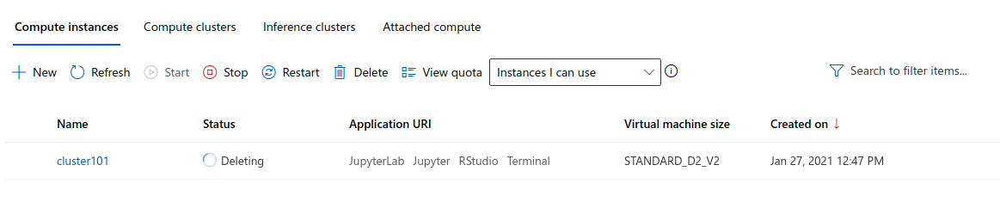

# Optimizing an ML Pipeline in Azure

[TOC]

## Overview

This project is part of the Udacity Azure ML Nanodegree.
In this project, we build and optimize an Azure ML pipeline using the Python SDK and a provided Scikit-learn model.
This model is then compared to an Azure AutoML run.


## Summary


In this project, we used **UCI Banking datasets** that contains marketing data about individuals. All the data related to direct marketing campaigns of a Portuguese banking institution. And we want to classify and predict that the client will subscribe to a bank term deposit or not (column y). 

## Scikit-learn Pipeline
To Find the best **Scitkit learn model**, I used below parameters

**For hyper parameter sampling**: I used discrete values

```
Regularization = [0.001,0.01,0.1,1,10,20,50,100]
```

```
Maximum number of iterations = [25,50,100,200]
```

**For Policy:** 

```
evaluation_interval=2
slack_factor=0.1
```

**Hyper parameters**

| No.  | Title                    | Value                      |
| ---- | ------------------------ | -------------------------- |
| 1.   | Hyper parameter Sampling | RandomParameterSampling    |
| 2.   | Primary metric name      | Accuracy                   |
| 3.   | Primary metric goal      | PrimaryMetricGoal.MAXIMIZE |
| 4.   | Policy                   | BanditPolicy               |
| 5.   | Max Total Runs           | 20                         |
| 6.   | Max Concurrent Runs      | 5                          |

**SK Learn Model:** **Logistic Regression**


### Sampling Parameter

In this experiment, we choose **Random Parameter Sampling** which faster, efficient, time-saving, and works perfectly. On the other hand **Grid Parameter Sampling** is exhaustively searched over the search space and takes usually long times and required more computation time and power.


### Early Stopping Policy

For this experiment, I  chose the ***Bandit Policy*** with following parameters:

```
policy = BanditPolicy(evaluation_interval=2, slack_factor=0.1)
```

**evaluation_interval**: The frequency for applying the policy. (**docs**)

**slack_factor**: The ratio used to calculate the allowed distance from the best performing experiment run. (**docs**)

In this policy, any run that doesn't fall within the slack factor or slack amount of the evaluation metric with respect to the best performing run will be terminated. So by using this policy,  it will retain only similar or better performance models.

### Best Model

- Regularization Strength: 100.0
- Max iterations: 100.0
- Accuracy: 0.914


## AutoML
In **AutoML**, I used following parameters

| No.  | Title                       | Value          |
| ---- | --------------------------- | -------------- |
| 1.   | Task                        | Classification |
| 2.   | Primary Metric              | Accuracy       |
| 3.   | Number of cross validations | 5              |
| 4.   | Experiment Time out minutes | 30             |

### Best Model:

Voting ensemble with 91.6 % accuracy


## Pipeline comparison
Comparison of best model metrics

| No.  | Pipeline Name | Metrics  | Value |
| ---- | ------------- | -------- | ----- |
| 1.   | Scikit Learn  | Accuracy | 91.4  |
| 2.   | Auto ML       | Accuracy | 91.6  |

In term of accuracy, there is no significant difference between both pipeline lines. It's only differ 0.2%, which is almost same. It's highly imbalance datasets, so accuracy is not the best metrics to find out the best pipeline. And in the **Sk Learn** pipeline you have the control to do everything and on the other hand **Auto ML** can figure out the best model by it self.

## Future work
1. Balance the datasets
2. Compare with more metrics
3. Train Auto ML with more times


## Proof of cluster clean up
Cluster Cleanup using code

```
compute_target.delete()
```

Proof:

1. 
2. 



